# Snowboard Kids 2 on the Power Mac G4

A native PowerPC port of the [Snowboard Kids 2 decompilation](https://github.com/cdlewis/snowboardkids2-decomp)
for a Quicksilver G4 running Mac OS X 10.5 with a Radeon 9000, built on the
platform layer of the [first game's port](https://github.com/southcitycapture/snowboardkids-decomp/tree/ppc-port).
The game sources are untouched; everything lives in this `port/` directory: a
libultra replacement, an interpreter for the display lists and the audio
command lists, a fixed-function OpenGL 1.3 backend, scripted input.

## Status (12 September 2026)

| Milestone | State |
| --- | --- |
| Toolchain: all 166 game sources + libultra audio/gu/pfs + libmus cross-compile and link | done |
| First frame: boot, threads, ROM DMA, the attract demo rendering on the real G4 | done |
| Overlay dispatch: one N64 address, fourteen native level functions | done |
| Menus: title screen, file select (EEPROM), level preview, the story overworld | renders and responds |
| 2D: the title logo, the tile-map backgrounds, sprites and the race HUD | matches the reference |
| Audio: ABI 1 confirmed, aspMain byte-identical to the first game, samples produced | plays, not yet listened to |
| A race | played end to end by the game's own CPU rider, first place |
| Self-play: `--racedbg`, `--peek`, `--autoplay`, `--soak`, `--nightmare` | works |
| The navigator: `--autonav`, `--menutrace`, `--saveevery`, `--trial`, `--plan` | works; the campaign wins a course, writes the EEPROM, leaves the town by the right door and aims itself at the next course |
| The lift wedge that stopped the campaign on Turtle Island | fixed -- it was the Nightmare row starving the task pool, not the borrowed path table. `docs/nightmare-row.md` |
| The boss races (courses 3 and 7): ten snowman heads, not a finish line | won by the boss pilot -- `docs/PLAN.md`, "The boss races, which no handicap can win" |
| The campaign end to end (every course, a save after each race) | **finished. Every course in the game is won on the user's own save** -- `sbk-nav: progress [111111111111] won=12`, 737,350 gold, and the credits roll. `docs/PLAN.md` has the campaign table |
| Course 9, the Haunted House | **the wedge is fixed.** Thirteen trials had wedged at sector 50 under every rung, path slot and board, and with `--nightmare` off; a pin autopsy (`--racedbg`, `sbk-pin:`) ruled out the ghost, the pendulum, the push zones, the other riders and the task pool, and named the real cause: `updatePlayerNormalDriving` sends any **CPU** rider whose speed drops below 0x5FFFF away from the lift to behaviour phase 4 (the ollie) and returns before `calculateAITargetPosition`, so a slow CPU rider cannot steer or re-aim. Not a port bug, and a human never hits it -- the human branch is a button test. Self-play is a CPU rider, so it does. Fixed by a marshal in `race_dbg.c` that pushes player 1 back over the threshold along the track graph. The course finishes now. `docs/PLAN.md`, "Course 9, the Haunted House" |
| The three Cross minigames (the gate on the last two courses) | **all three are won on the user's own save.** Shoot Cross took an aiming shot pilot (the course does not aim for you and its targets push the rider away rather than pull it in) plus one target twenty-one million units above the road that is reached by moving it in front of the rider for one shot, capped and counted. **X Cross** turned out to be a port bug and not a game rule: `beginPostTrickLaunchStep` puns three adjacent globals as a `Vec3i` and the Mach-O linker laid them out *descending*, so every jump in the port -- by every rider on every course -- was launched with two words of unrelated data. With the pun made real in `patches.txt` the rider scores 435 of the 300 it needs. **Speed Cross** is 87.8 seconds of a ninety-second clock on handling, cornering and lateral deadzone; top speed was never the lever, because `race_main.c:854` clamps every rider to 0x180000. `docs/PLAN.md`, "X Cross", "Speed Cross" |
| Course 11, the Ice Land boss (the last course, and the credits) | **won, with one declared handicap.** Four heads of thirteen for ten races running, and the cause this file used to give -- "the rider takes a worse line than the boss and gets knocked off it", read off `wall=14,0,0,0` -- was wrong. A per-sector census (`--sectorlog`, one line per rider per sector) puts the two riders side by side: **wall 22 retraces, hop 938, stun 1808** against a boss that never touches a wall, never hops and is never stunned. The rider loses five sectors in the first three hundred frames to one knockback and the Haunted House lock-out, and our rider and the boss cruise at very nearly the same speed, so it never gets them back. Fixed as far as it can be fixed: a lock-out breaker armed on the lock-out itself (the marshal cannot reach a rider that is hopping *downhill*, because that rider is still making progress), the throw window widened to the star's own homing capture radius rather than the boss's collision node, the trigger cut to the star's real flight time, and a governor that will not let the rider overtake -- `updateIceLandBoss` is a rubber band gated at 0xE00000 whose wind-up is +0x1000 a frame against a wind-down of -0x80, so one overtake hands the boss the game's own 0x180000 ceiling for longer than the race lasts. The last of it is a handicap and is logged as one in every race it applies to: `--bossslow 48` holds the boss's own speed cap at 48% of what `updateIceLandBoss` just asked for, and nothing else changes. `boss hp=0 defeated=1, 13 hp drops from 74 throws`, and the credits roll for four minutes on the real G4 (`g4-shots/sbk2-credits.png`, `sbk2-credits-mid.png`). `docs/PLAN.md`, "Course 11: the Ice Land boss, in full" |
| **A real port bug a human hits: the ollie** | `beginPostTrickLaunchStep` builds the jump impulse in three separate file-scope globals and hands the address of the first to `transformVector2`, which reads three consecutive `s32` as a `Vec3i`. On the N64 they sit in declaration order and the pun is exact; the Mach-O linker laid them out **descending** (0xb428, 0xb424, 0xb420), so every jump in the port, by every rider on every course, was launched with two words of somebody else's data. Nothing crashes and nothing looks obviously wrong -- the rider just never gets the air the game intends, and multiplying `baseAcceleration` by five changes the launch by not one unit, which is the measurement that says the field is not being read at all. Fixed in `patches.txt` by making the three one array. `docs/PLAN.md`, "The audit for the ollie bug's siblings", sweeps the rest of the source for the same shape |
| The audit for more of that class | done. All 1,477 file-scope globals swept for every construct that reads outside one global. **Pinning protects almost all of it** -- a pinned global keeps its N64 address in the emulated RDRAM, so its neighbours are still its N64 neighbours -- and only the 248 unpinned ones are exposed. Two are read across: the ollie, and `gCharacterEffectSpawnPointsBoard`, four snowboard corners declared `s16[16]` and read as 24 `s16`, whose last two corners live in `gShortcutChanceByMemoryPool` on the N64. One more of the family turned up without any pointer arithmetic to give it away: the cutscene category count, read as a big-endian `u16` across two `u8`s that the port puts in different *sections*, 132 KB apart |

The title screen matches the emulator reference frame
(`g4-shots/sbk2-s2dex-fix1.png` against Mupen64Plus's `snowboard_kids2-020.png`):
logo, background, menu, copyright lines, Rumble Pak badge. Until the combiner
fix in `gfx_pc.c` (see `docs/PLAN.md`, "a combiner input gfx_pc did not have")
everything drawn under the game's sprite setup list was transparent black.

## Screenshots (taken on the G4)

| | |
| --- | --- |
| 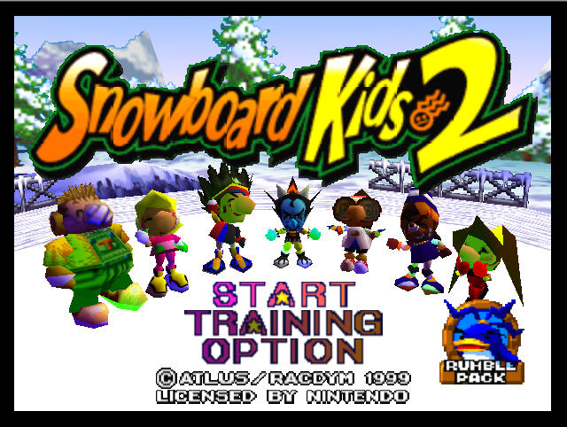 | 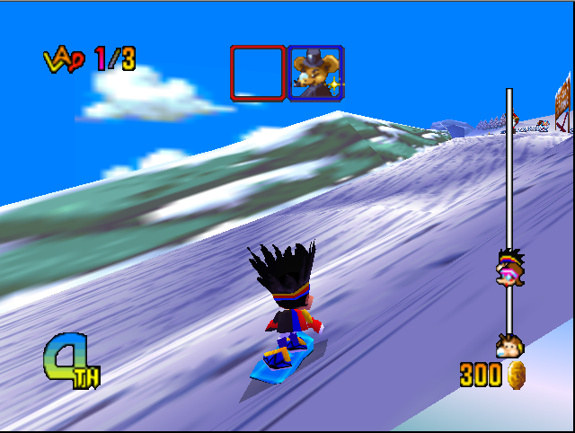 |
| The title screen: logo, snow background, menu, copyright, Rumble Pak badge. Pixel-for-pixel the layout of the emulator's frame. | A race with the full HUD: lap, item slots, place, the progress bar with rider heads, coins, and a sky that reaches the horizon. |
| 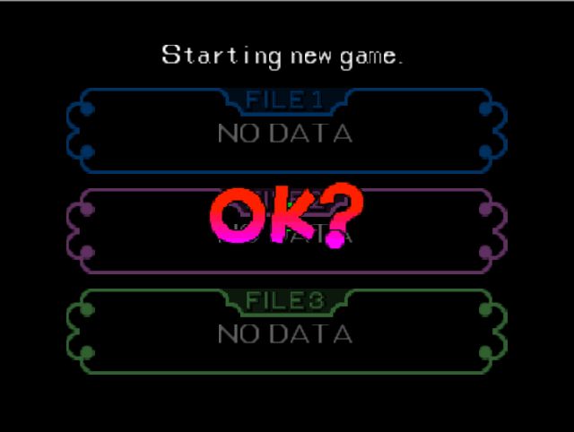 | 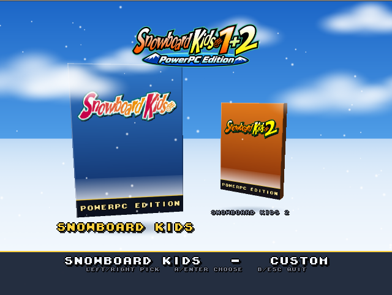 |
| The file select, drawn from the 512-byte EEPROM image. | The launcher, written in this game's own sprite font with this game's own title logo on the box front -- both read out of the cartridge dump at run time. |

More, uncropped, are in `~/Apps/islandPowerPC/g4-shots`.

## Build and run

    ./build-mac.sh                # the upstream N64 build first (map, linker script, generated headers)
    port/build-ppc.sh -j6         # Docker cross build -> port/build-ppc-darwin/snowboardkids2
    port/tools/make_bundle.sh     # SnowboardKids2.app with the ROM in Resources

    snowboardkids2 [--fullscreen] [--windowed] [--nolauncher]
                   [--drawdistance N] [--haze[=0|1]] [--hazedbg]
                   [--play SCRIPT|MOVIE.m64] [--record MOVIE.m64]
                   [--frames N] [--hashframe] [--mute] [--noaudio] [--wav OUT.wav]
                   [--pak FILE.mpk] [--nopak] [--eeprom FILE] [--unlockall]
                   [--nopad] [--trace] [--dumpdl N]
                   [--s2dextrace]
                   [--dumpframes N] [--dumptris] [--bigtri N] [--perf]
                   [--racedbg] [--peek ADDR:LEN] [--autoplay] [--soak] [--nightmare]
                   [--autonav] [--menutrace] [--saveevery N] [--status]
                   [--startrung N] [--nobosspilot] [--bosssupply N]
                   [--trial SPEC] [--plan LEVEL:CHAR:BOARD:BOOST,...]
                   [--shotdbg] [--shotsnap N] [--shotrange N] [--shotcooldown N]
                   [--shotcarry N] [--shotdetour N] [--notrickpilot] [--trickperiod N]
                   [snowboardkids2.z64]

`--nopak` turns off the EEPROM as well as the Controller Pak, and the game then
says "Backup memory is corrupted" on the save screen -- which is how the EEPROM
was proved to work. `--eeprom FILE` is the exception: a scratch save file that
works alongside `--nopak`, so an unattended trial never touches the real
`eeprom.sav`. `--unlockall` runs the game's own `unlockAllContent` cheat on
whatever save block is loaded, so the course list offers every course; it
belongs with `--eeprom` and nowhere near a save you want to keep.

Scripts in `scripts/`: `title-start.txt`, `menu-walk.txt`, `menu-soak.txt`.

## Draw distance and the distance haze

The launcher, the in-game overlay (**F1** or the pad's **View** button) and
`~/Library/Application Support/SnowboardKids/settings.txt` are the first
game's, shared file for file; the sequel's copies differ only in which game
they call themselves -- see **The launcher** and **Bring your own ROM** below.
The keys:

    game=sbk2          mode=original|enhanced|custom
    draw_distance=1..4 resolution=native|n64|2x
    filter=none|scanlines|grille|smooth
    texfilter=rdp|point|bilinear          msaa=0|2|4
    widescreen=4:3|16:9                   fadein=0|1
    fullscreen=0|1     vsync=0|1
    volume=0..100      launcher=0|1       perf=0|1
    haze=0|1

**Original** is draw distance 1, `n64` resolution, no filter, no haze, no
fade-in, no anti-aliasing, `texfilter=rdp`, 4:3. **Enhanced** is draw distance
2, `native` resolution, no filter, **haze on**, **fade-in on**, **2x
anti-aliasing**, `texfilter=rdp`. Touching any single setting moves Mode to
CUSTOM rather than lying -- except widescreen, which is a framing choice for
the player's own screen and belongs to neither preset.

`--drawdistance N` multiplies the three race far planes in
`src/race/race_session.c` (3800 for a normal race, 3000 split-screen, 2000 for
a boss) by N, through `port/patches.txt`. The extra range is honest geometry,
and that is the problem: the N64 clipped it, so nobody ever made it look like
anything. At `--drawdistance 4` on Sunny Mountain a band of far terrain stands
across the sky at the chairlift, hard-edged and fully lit, with clouds behind
it.

`haze=1` fades that band into the course's own air. It is not a post-process
and not a shader: F3DEX2 already carries a per-vertex fog factor, gfx_pc
already computes one for `G_FOG` geometry and `gfx_gl13.c` already hands it to
`GL_FOG` as a per-vertex fog coordinate, which the Radeon 9000 does in fixed
function for nothing. `port/src/gfx/haze.c` fills that same slot in for race
geometry the game did not fog far enough out.

* **The sequel already fogs its races** -- every race viewport gets
  `setViewportFogById(id, 0x3E3, 0x3E7, ...)`, a band in the last half a
  percent of the *normalised depth* range. Normalised depth stretches with the
  far plane, so once `--drawdistance` has moved the plane that band lands
  nowhere useful. The haze therefore does not stand aside for it: it takes
  whichever of the two factors is thicker, per vertex. The colour is the same
  colour either way, so this can only add haze, never remove the game's.
* **Distance** is exact, not estimated. `setViewportPerspective` is
  `guPerspective(..., scale = 1.0f)` MUL'd with the view matrices into the
  same `G_MTX_PROJECTION` slot, so a vertex's clip-space *w* is its eye
  distance; gfx_pc takes the length of the matrix's w column anyway, which is
  why the first game's 0.5 scale needs no special case.
* **Which viewport** comes from `gSPPerspNormalize`, which is
  `2*65536/(near+far)` and so names the far plane on its own. At
  `--drawdistance 4` the race camera carries 8 and the root viewport that
  draws the sky carries 13, so the sky is never fogged into itself.
* **Colour** is the game's own `LevelConfig.environmentColors.fog`
  (`src/data/course_data.c`) -- the colour `race_session.c` already hands
  `setViewportFogById`, authored per course and per time of day: `50 70 F0`
  for Sunny Mountain's blue, `FF FF C0` for the sunset course, `07 00 20` and
  `00 10 20` for the night ones. No table of the port's own, and no guessing
  at the sky.
* **Range** runs from 0.85x the far plane the *unmodified* game clipped at to
  2x that distance, capped at the extended plane. Anchoring it to the old
  horizon rather than the new one is the whole trick, and it was measured
  rather than guessed: a three-way pixel diff between `--drawdistance 1`,
  4-without-haze and 4-with-haze says the geometry `--drawdistance` adds is
  not spread over the new range at all. It is a band just past where the N64
  clipped -- the trees and the hut on the ridge at Sunny Mountain, 23,000
  pixels of one 640x480 frame, between 3800 and about 5000 units. A ramp that
  reached full haze at 15,200 was 6% thick there.
* **Props do not stop popping for free, and that was wrong here until
  2026-09-13.** `--drawdistance` scales the three far planes and nothing else;
  `isObjectCulled` (`src/graphics/graphics.c`) keeps every prop, rider, item
  box and effect inside a cube of 4,074 units around the viewport, and that
  number does not scale. So at 4x the ground runs out to 15,200 units and is
  hazed flat by 5,700, while an object still vanishes at 4,074 where the haze
  is only about 40% thick. That is what the `fadein` option below is for.

`--hazedbg` prints a line a second: the course, the colour, the range, the
perspNorm the race camera carried against every other perspNorm in the frame,
how many triangles were tinted and the farthest vertex seen. Scripted and
golden runs force the haze off, like the filters, so `regress` still replays
bit-identical.

## The four Enhanced rendering options

Added 2026-09-13 in both ports at once: **far-object fade-in** (`fadein`),
**widescreen** (`widescreen=4:3|16:9`), **anti-aliasing** (`msaa=0|2|4`) and a
**texture filter override** (`texfilter=rdp|point|bilinear`). The machinery is
the first game's, file for file --
[its README](../../snowboardkids-decomp/port/README.md) has the long version,
including what the Radeon 9000 turned out to allow (`GL_ARB_multisample` and
`GL_EXT_blend_color` yes, a true three-point filter no) and why there is no
fake `n64` filter. What is different here:

  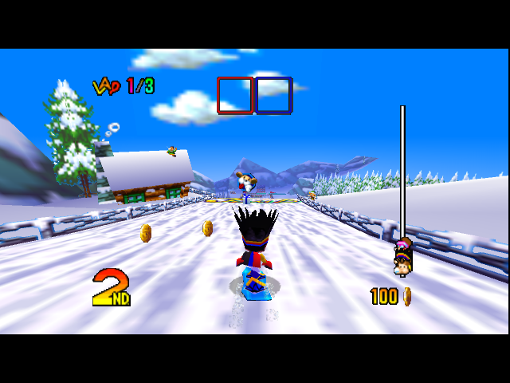

* **The fade-in has more to do in the sequel than in the first game**, because
  the sequel's cull box does not grow with `--drawdistance` (above). The port
  is handed the box's half extent by `patches.txt` wrapping
  `RACE_CULL_BOX_HALF_EXTENT_FIXED`, and fades objects across the last 14% of
  it, 3,504 to 4,074 units.
* **It has to know which matrices belong to a cullable object**, and this is
  the sequel's contribution to the design. Keyed on the object's origin
  distance alone -- `MP[3][3]` turned into world units by the same w-column
  scale the haze uses -- the fade took 20,000 of 40,000 triangles a second
  down to alpha 0 at `--drawdistance 4`: the course's own terrain is drawn in
  chunks with their own far-away origins, and a distant chunk looks exactly
  like a distant prop. So `patches.txt` has `setupDisplayListMatrix` -- the
  one function that builds a `DisplayListObject`'s transform, immediately
  after `isObjectCulled` has let it through -- hand each matrix pointer to the
  port, and a draw is faded only when the modelview it loaded is one of them.
  With the table in place the same race fades 0 to 250 triangles a second, all
  of them objects.
* **And then the honest measurement**: a frame-exact pixel diff of the same
  retrace with the fade on and off is **11 to 18 pixels**. By the time an
  object reaches 4,074 units it is a few pixels across and already deep in the
  haze, so the pop the option removes is a real one but a small one. It is in
  Enhanced because it costs nothing measurable (0.04 ms of a 2.4 ms frame) and
  because a hard edge appearing from nothing is worth not having, not because
  it transforms a race.
* **Cost on the G4**, one measured race each (level 0, `--drawdistance 2`,
  640x480 windowed, `--perf` averaged over the same stretch of retraces):
  3.21 ms of gfx with all four off, 3.32 with the fade-in and 4x
  anti-aliasing, 3.37 with widescreen on top. 60.0 Hz and 42-43% CPU
  throughout. The first game's port has the full per-option table.
* **Widescreen** widens the race cameras' field of view and leaves the HUD,
  the menus and the S2DEX passes in a centred 4:3 box, exactly as in the first
  game -- the S2DEX object commands go through the same
  `gfx_adjust_x_for_aspect_ratio` as everything else (`gfx_pc_tex_quad`), so
  nothing had to be done for them.

## The launcher

  
  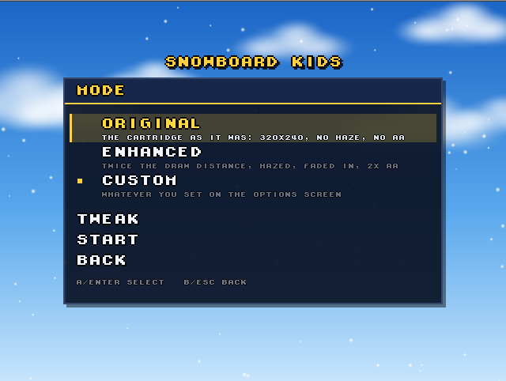
  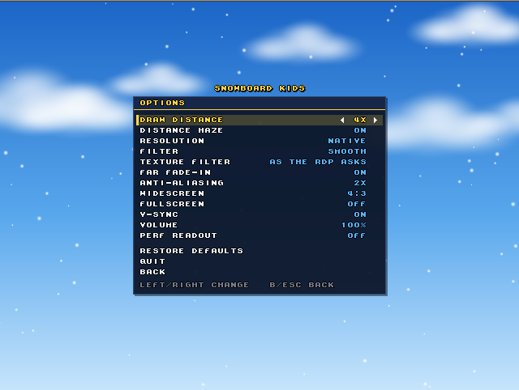
  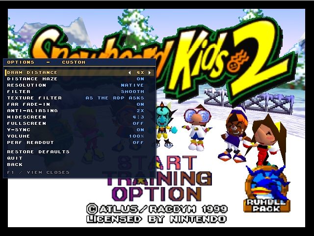

Three screens on a Sunny Mountain sky with drifting clouds and light snowfall:
**Pick a game** (the two games as N64 boxes on a snow shelf, the selected one
lifted and slowly turning), **Mode** (Original / Enhanced / Custom, each with
a line saying what it is, plus Tweak and Start), and **Options** (the settings
above, one row each). Arrows or the stick move, Enter or A selects, Esc or B
backs out and quits from the first screen. Transitions are 160 ms.

The code is the first game's, file for file -- `port/src/ui/ui.c`,
`ui_gl.c`, `ui_scene.c`, `ui_rom_art.c`, `rom_codec.c` -- and its design notes
live in that repository's `port/docs/PLAN.md`. What differs here is only which
bytes it reads:

| | first game | this game |
| --- | --- | --- |
| font sheet | `_2427D0` at ROM `0x2427D0` | `FONT_DATA_TABLE` at `0x215D70` |
| title logo | `_5DCBE0` at ROM `0x5DCBE0` | `titleLogo` at `0x414CF0` |
| compression | Huffman then LZ | two-byte token LZ ("Sno") |

**All the type on the launcher is the game's own sprite font and each box
front carries the game's own title logo**, read out of whichever cartridge
dump the player owns, at run time -- so none of the games' art is in this
repository. Both games keep their ASCII font as a 64x64 CI4 sheet of 8x8 cells
indexed by `ascii - 0x20` and both title logos as a 10x8 grid of 32x32 CI8
tiles, so one decoder each serves both; the port carries *both*
decompressors, because either bundle draws both boxes and so reads the
sibling's ROM as well as its own. With no ROM at all the port's own 5x7 font
and a generated box front spell the whole thing out instead.

The sky, the clouds, the snow, the boxes and their shadows are generated in
code -- one 64x64 soft blob is every cloud and every flake, and a box is six
quads at the proportions of a real N64 box (1 : 1.4 : 0.15) lit by one
directional light. Drop `port/resources/box-sbk1.png` or `box-sbk2.png` in and
run `port/tools/gen_box.py` to put your own picture on a front instead.

**No menu sounds.** The games' menu effects are sequenced by their own sound
driver out of banks the audio thread loads after boot, and the launcher runs
before any of that exists; the port makes no sound there rather than inventing
one that is not the game's.

Measured on the G4 with `--perf`, which the launcher answers with its own line
a second:

    sbk-launcher: 60.0 Hz  draw 0.80 ms  frame 15.50 ms

## Bring your own ROM

  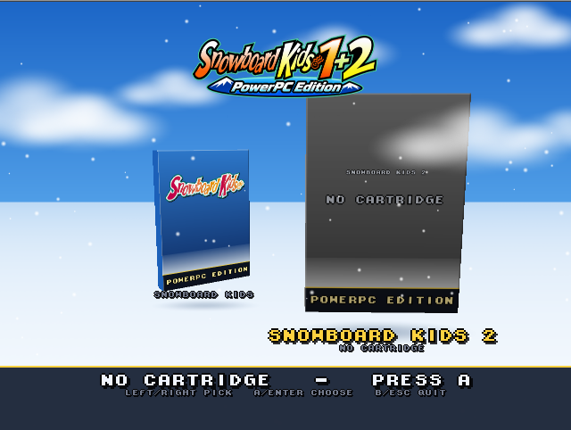
  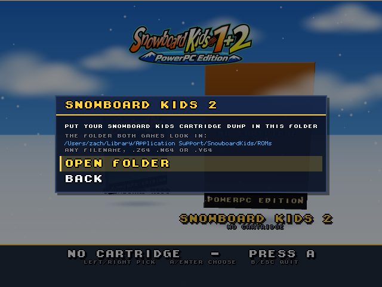
  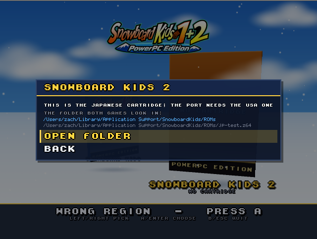

Both bundles share one folder for the player's cartridge dumps, next to the
Controller Pak and `settings.txt`:

    ~/Library/Application Support/SnowboardKids/ROMs/

**Any filename**, and any of the three byte orders: the order is read off the
first four bytes (every N64 ROM starts with the word `0x80371240`, so which
permutation a file begins with names it) and `.v64` and `.n64` images are
converted to big-endian as they load. The extension is never consulted.

Which game a file is comes from the ROM header's cartridge id at `0x3C` (`SK`
for the first game, `K2` for this one); whether it is the right one comes from
its SHA-1:

| game | SHA-1 of the USA dump | size |
| --- | --- | --- |
| Snowboard Kids | `1583bacc9046a360df8ea4d536942155247e154c` | 8 MB |
| Snowboard Kids 2 | `5ce896fd64276948bc2b8cccd8cd51c25a9f32aa` | 16 MB |

Those are what each decompilation's own matching build produces, so "the ROM
this port was built against" and "the retail USA cartridge" are the same bytes.

A file that is neither game is ignored. A file that is one of them but wrong
says so in plain words -- *"this is the Japanese cartridge; the port needs the
USA one"*, or *"this file is damaged; the port needs a clean USA dump"* --
rather than failing to boot. With nothing at all for a game, its box is grey
and unlit with a small *no cartridge* label, and choosing it shows the folder
path with an **Open folder** action; leaving that panel rescans, so dropping a
file in and coming back lights the box up without restarting.

The bundle's own `Contents/Resources` ROM is still read, **last**, so a
personal build in the shared folder wins. Hashes are cached by path, size and
mtime in `.rom-hashes` so a 16 MB SHA-1 is paid once, not at every launch. A
scripted run (`--play`, `--record`, `--headless`, `--nolauncher`) skips the
scan entirely and keeps the old path search, so golden replays are untouched.

## Self-play

The game beta-tests itself. `--autoplay` hands player 1 to the game's own CPU
rider; `--nightmare` retunes a spare row of `gAIPlayerParams` so every rider
throws items hard and carries no speed handicap, and gives player 1 the fastest
board -- the row's numbers are **searched, not guessed**, and
`docs/nightmare-row.md` says what they are and what happens when they go off
the end of the game's own scale (the race stops ending); `--autonav` walks the menus by name and drives the campaign
between races; `--soak` is the same with the save point skipped: the town cannot be left by pressing A (A walks into the rider picker and out again for ever), so a soak uses the navigator too, and only writes the EEPROM if `--saveevery` says so.

    snowboardkids2 --fullscreen --autonav --autoplay --nightmare --saveevery 1

`--menutrace` prints the sequel's menu map as it moves -- every screen is named
with `dladdr()` off the task scheduler's `gamestateHandler`, so there is no
hand-written table. `--racedbg` prints the four riders once a second and
`--peek ADDR:LEN` dumps RDRAM.

**Boss races.** Courses 3 and 7 are decided by the boss's ten snowman heads,
not by the finish line -- our own rider crossing it does nothing -- and the CPU
rider can never throw the one item that takes a head off. The boss pilot
(`port/src/debug/boss_pilot.c`, on by default with `--autoplay`, off with
`--nobosspilot`) hooks the game's own `processPlayerItemUsage` and throws the
star when the boss is in range and inside a firing window worked out from the
star's flight; the pan, which cannot miss, is what the navigator's boss ladder
supplies after a loss (`--bosssupply N`, retraces between hand-outs). Every
conjured item is logged and counted against the ones the rider picked up itself.
`docs/PLAN.md`, "The boss races, which no handicap can win", has the chain.

**The Cross minigames.** They are buildings in Jingle Town, not courses, and
each is first a clock: 150 seconds on Shoot and Speed Cross, 90 on X Cross and
a second 90 on Speed Cross's own race timer, after which `playerLost` is 1
whatever the score is. So the Cross ladder is three ladders, one per game,
kept per Cross game across the rotation between them -- and they do not share
a rung, because the levers that pass them are different levers.

On Shoot Cross the shot pilot hangs off the same hook as the boss pilot and
does the aiming the course will not do: it walks the twenty targets, writes the
rider's heading straight at the nearest one still standing for two frames, and
puts it back. `--shotdbg` prints the target table and a line a second;
`--shotsnap`, `--shotrange`, `--shotcooldown`, `--shotcarry` and `--shotdetour`
are its knobs, and `--noshotpilot` turns it off. On X Cross the trick pilot
(`--notrickpilot`, `--trickperiod N`, `--trickflags N`, `--tricktarget N`)
answers `determineAIPathChoice` for our rider so it jumps at all, and then
stops once it has banked enough skill points, because X Cross is two tests --
300 points *and* a ninety-second clock -- and a rider that tricks the whole
street scores 2,610 and still fails.

Five levers reach the rider now rather than one. `--trial boost=N` was the
only handicap for eight courses and it is a top-speed lever, which is the
wrong lever for both of the last two Cross games: `accel`, `hand`, `corner`
and `dead` put the same 1/256ths on `baseAcceleration`, `handling`,
`cornering` (which takes a negative -- it is the *drag* a turn costs) and
`lateralDeadzone`. `--trial level=12|13|14` runs one of them on its own.

`--autonav` plays the campaign, not one course: it leaves Jingle Town by the
door that leads to the course list (`unk427 = 0xFF`, not a location id -- see
`docs/PLAN.md`) and parks the list on whichever course the game has marked
`levelUnlockStatus == 5`, which is its own "next up". When the course list has
nothing left it walks into the three Cross minigames instead -- they are
buildings in the town, not courses, and slot 10 does not open until all three
are won. They are also not races: each has its own pass mark (`playerLost`,
twenty targets, 300 skill points) and `finishPosition` says 1st either way.

**A handicap applied at the handoff is not applied to the race.** `initPlayer`
re-runs `applyCharacterSnowboardStats` a second or two after `initRace`, which
wiped the retune -- the boost lever did nothing at all for the first six
courses. It is held now, and `--racedbg`'s `spd=<current>/<baseMaxSpeed>` is
where to check that a lever survived into the race.

`--trial level=N,char=C,board=B,boost=X,relief=R,tax=T,pathslot=S,quit=1` runs
one race as an experiment and prints a result line -- place, frames, gold, and
the per-rider count of frames spent scraping a track wall. A trial takes about
**thirty seconds** of wall clock on the G4 and is deterministic, so the
handicap levers are worth sweeping rather than reasoning about; `relief` and
`tax` pin themselves against the navigator's ladder so a rung can be
reproduced exactly.

 `port/tools/nightmare_search.py` sweeps trials on the
G4, keeps `port/tools/nightmare_results.csv`, records golden movies into
`port/scripts/golden/` and replays them (`regress`). `docs/PLAN.md`,
"Self-play", has the state the tooling keys on and why.

The save files live in `~/Library/Application Support/SnowboardKids2`:
`eeprom.sav` (the raw 512-byte EEPROM image emulators use) and
`controller-pak-1.mpk`.

## What is different from the first game's port

The short version: KMC GCC instead of IDO, F3DEX2 instead of F3DEX, an EEPROM,
and **overlays** -- every level is linked at the same address, so a native link
has to rebuild the indirection the N64 got for free. `docs/PLAN.md` has the
long version, the survey facts and the gotchas.

## Licence note

`src/gfx/gfx_pc.c` derives from sm64-port, whose licence allows source
distribution only (`src/gfx/gfx_s2dex.c`, the S2DEX interpreter beside it, is
this port's own code). Share this branch as source; do not distribute binaries.
